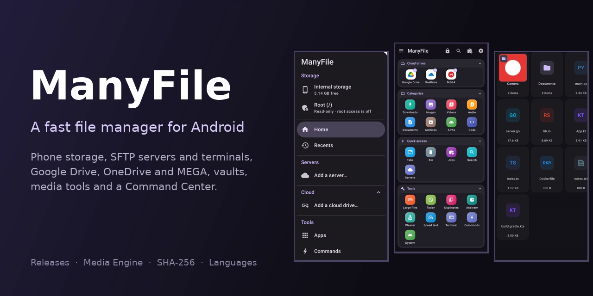

<p align="center"></p>

# ManyFile

**ManyFile** is a modern Android file manager focused on fast file operations, powerful tools, local and remote storage, and an uncluttered interface.

This repository is the **official public release repository for ManyFile**.

It contains release binaries, checksums, release information, translations and optional ManyFile components. The application source code is maintained separately and is not included in this repository.

## Download

Open the **[Releases](https://github.com/i-tct/many-file/releases)** section and download the latest:

- `manyfile-<version>.apk`: ManyFile for Android
- `manyfile-media-engine-<version>-arm64-v8a.apk`: the optional Media Engine
- `.sha256` files: SHA-256 checksums for verifying downloads

For most users, only the main ManyFile APK is required.

## ManyFile Media Engine

The **Media Engine** is an optional companion component used for advanced media functionality: Media Downloader and cutting songs.

It includes components such as:

- yt-dlp
- CPython
- FFmpeg / FFprobe
- a JavaScript runtime (QuickJS)

The Media Engine is kept separate so the main ManyFile application can remain lightweight. Cloud drives (Google Drive, OneDrive and MEGA) are part of ManyFile itself.

It does not appear as a normal standalone application in the Android launcher. ManyFile communicates with it directly, and only with an engine signed with the same key as ManyFile itself.

ManyFile downloads the right Media Engine release by itself (on Wi-Fi; on mobile data it asks first) and asks before installing it. It can also be installed from Media Downloader inside ManyFile, or by hand from Releases.

## Installation

1. Download the latest ManyFile APK from **Releases**.
2. Open the APK on your Android device.
3. Allow installation from the browser/file manager if Android asks.
4. Install ManyFile.

Updates can also be found and installed from inside ManyFile: Settings → About → Check for updates.

## Verify a download

Each release includes a `.sha256` file next to each APK.

```bash
sha256sum manyfile-<version>.apk
cat manyfile-<version>.apk.sha256
```

Both lines must show the same checksum. ManyFile checks it by itself when it downloads an update or the Media Engine.

## Languages

ManyFile is in English. Other languages are downloaded inside the app, from the [`languages`](languages) folder of this repository:

- `languages/languages.json` lists the languages that can be downloaded;
- `languages/strings-<code>.xml` holds one language's texts, in Android's `strings.xml` format, with the same names as the English ones;
- `languages/strings-en.xml` is the English template to translate from.

See [`languages/README.md`](languages/README.md) for the format.

## Repository layout

```
many-file/
├── README.md
├── assets/          pictures for this page
└── languages/       downloadable translations (languages.json + strings-<code>.xml)
```

APKs and their checksums are attached to **Releases**, never committed to the repository.
